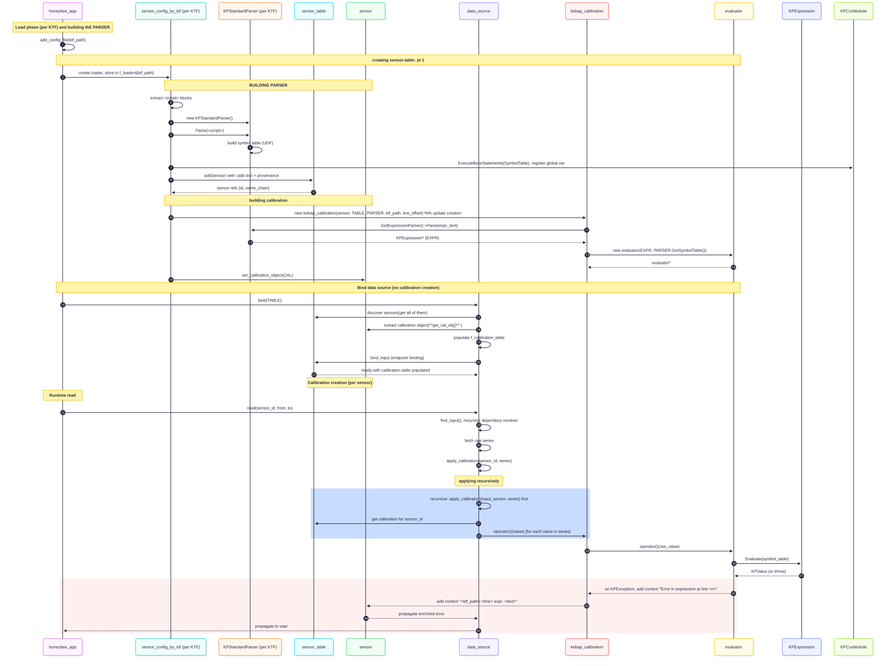
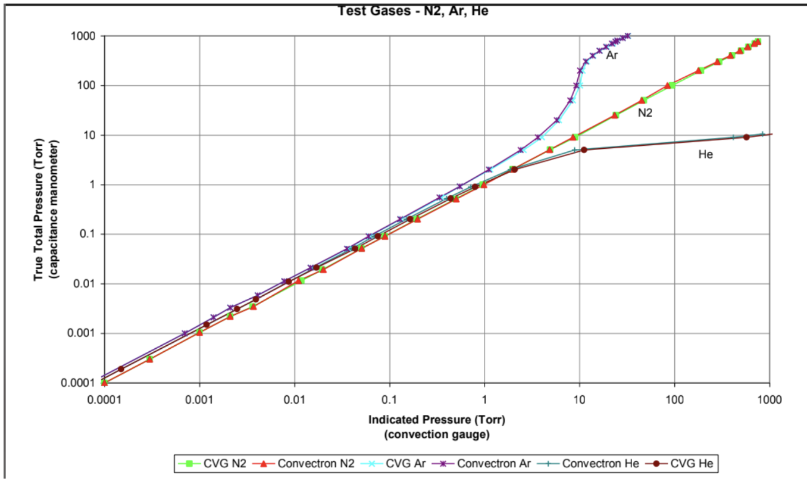

Honeybee Upgraded Calibration Framework Release
==================================================

## 1. Overview

### 2.1 Architecture Overview
- class DG (png link or actual link)
to have it one, image, look at ordering of the class and redorder to make it look better and less longgated 







- Key components and relationships
The current design is language agnostic so that in the future, other calibration engines from a Rust/python/... source would easily be able to be integrated into the system 

- abstraction point: 
    the sensor_config is abstract so that we can sensor_config that tailor to specific calibration engine

    Ex: derived class specific for..
        sensor_config_by_ktf
        sensor_config_by_rust
        sensor_config_by_py
        .
        .
        .
        .


#### Class responsibilities: 

honeybee: main orchestrator of application, lifetime of running
    
    holds: Registry of all sensors, connection to data backend, configuration loader, user-provided runtime variable

    Does: Resolves sensor names to IDs, delegates to data_source for raw data fetch, returns packaged results.


sensor_config_by_ktf: Parse KTF files and populate sensor table

    Holds: 
    The Kebap parser instance that compiles all UDFs and global variables, the KTF file path being processed, user-supplied configuration variables

    Does: 
    Reads KTF files, extracts #% script blocks, parses Kebap code, creates sensor objects with calibration objects, registers them in sensor table

sensor: signifies a single measurement point

    Holds: (also some metadata about a sensor)
        -  Sensor's unique ID, full hierarchical name path (e.g., "ATDS.Gas.Inj.Alicat.sccm") and display label
        -  raw calibration formula text, reference to the calibration computer

sensor_table: Manage collection of all sensors
    
    Holds: Complete registry of all sensors (indexed by unique ID and searchable by hierarchical name)
    Does: Store/retrieve sensors by ID or name chain. Provides lookup helpers for finding sensors by partial name match. Read-only after configuration

data_source: calibration applied here, fetch data and apply calibration
    
    Holds: connection to DB, query and etc.
    Does: binds to sensor table, use each sensor's calibration object to apply and return the transformed series 

calibration: Define calibration interface(Abstract)
    
    Holds: what the calibration does and sensor input is coming from 

kebap_calibration: Evaluate Kebap calibration expression during runtime
    
    Holds:  Expression + it's evaluator, ktf source and the line for error sending
    Does: parse expression and create evaluator when constructing, then use evaluator to transform values during runtime


evaluator: runtime calculator for calibration expression 
    
    Holds: Compiled expression tree, reference to the global symbol table with all defined functions and constants
    Does: evaluate expression using the referenced value and return result 


**Main Kebap engines(external)**

KPParser: Compile Kebap scripts into executable
    
    Holds: Global symbol table with all functions and constants, parsed module with variable definitions
    Does: compiles script block and gives parser for expressions

KPSymbolTable: Central namespace for all Kebap definitions

    Holds all functions and variables, and maps names to value 


### 2.2 Core Extension Capabilities
**On top of these existing capabilities of Honeybees**
- **Multi-stage calibration pipelines**: 
    Chain calibrations where output of one feeds into another
- **Dependency-aware processing**: 
    Automatically resolves sensor dependencies(layered dependency)

**The following are offered in the new release version 1.1**
- **User-defined functions and Global Variables**: 
    Write calibration logic in Kebap(light embedded script) without recompiling
    Including: 
        - Functions of any-type
        - global variables 

- **Modular calibration design**: 
    Import calibration scripts across configs
- **Dual data streams**: 
    Access both raw and calibrated data simultaneously.
    Can can some end points be fetch calibrated and some raw

Core extensions includes: (Please reference the release document for further details)


- Multi-stage calibration pipelines:  
	Chain calibrations where output of one feeds into another
- Dependency-aware processing:  
	Automatically resolves sensor dependencies(layered dependency)

The following are offered in the new release version 1.1

	User-defined functions and Global Variables:  
	Write calibration logic in Kebap(light embedded script) without recompiling  
	Including:  
	- Functions of any-type  
	- global variables
	
	- Modular calibration design:  
	    Import calibration scripts across configs
	    
	- Dual data streams:  
	    Access both raw and calibrated data simultaneously.  
	    Can can some end points be fetch calibrated and some raw


## 3. Usage Guide

### 3.1 KTF Configuration Syntax

#### 3.1.1 Unimported script

All lines you wish to be recognized and extracted as calibration script **must start with #% and must come before the the channel definitions**

    Here is a simple example: 

    #% float times5(float x) { return 5 * x; }

    later a channel endpoint could call it

**Practical Example**: 
    
    Assumptions: 
    - you are using a digital Pirani gauge model giving original indicated pressure (not accounting for specific type of gas in system) 
    - We have a gas system that has helium, but because our pirani may under or over report pressure without that awareness, 
        we will calibrate readout out before any further analytical steps

use this conversion graph for guidance on why our function are the way they are for this instance



This is what our function script section would look like above the channel definitions

```
**Script section** 
#% float torr_He (float torr) {  
#%      double torr_He_val = 0.0;
#%      if (torr < 1){
#%          torr_He_val = torr * 1.1;
#%      } else if (torr < 10) {
#%          torr_He_val = torr **0.7;
#%      } else {
#%          torr_He_val = torr **0.33 + 5;
#%      } 
#%      return torr_He_val;
#% }
#% float conversion_f = 1013.25 / 760;  /* Global constant: used in mbar_He function below */
#%
#% float mbar_He (float mbar) { return torr_He(mbar / conversion_f) * conversion_f; }  /* Function using global constant conversion_f */

{this is a simplied channel structure starting at channel definition, please reference README.md file to see an example of how a full channel structure looks like}

**Channel definition section** 
#       Module: 
#           id: { name: prg, label: Pirani gauge }
#           channel:
#             id: { name: torr, label: Vacuum pressure in Torr }
#             x-dripline_endpoint: 
#               tag: pirani
#           channel:
#             id: { name: mbar, label: pressure in Mbar }
#             default_calibration: torr: torr * conversion_f
#           channel:
#             id: { name: mbarHe, label: Helium corrected pressure in Mbar }
#             default_calibration: mbar: mbar_He(mbar) 

```

Channels and what they represent: 

    1. torr: Initial gauge pressure held in our database (Torr)
    2. mbar: Initial pressure converted(Mbar)
    3. mbarHe, Helium corrected pressure (Mbar). **Notice** it's dependant on two previous chained calibration

This shows: 
    
    1. Utilizing User Function: 
        
        Channels can reference and call on user defined functions without compiling the function script. The function script is extracted and parsed into Kebap before any channel calls. So each function is mapped and prepped before and can then be used for calibration, similar to a function call in programming. 
        notice the input parameter must be defined and pointed out before being use
            
            ```ex: 
                @channel 'mbarHe'
                    Notice  ---> { **mbar**: mbar_He(**mbar**) }
            ```


            The channel id, which has a name, would identify the output(calibrated or not) of the channel it's dependant on
                
                - part of resolving and referencing dependencies in chain calling 

    2. Chaining:
        Using the result/output of a channel as calibration input for another 
            honeybee + Kebap: resolve the dependency of channels before runtime to make this happen 

            The example channels: **mbarHe** --(uses)->  **mbar**  --(uses)->  **torr** (change)


#### 3.1.2 Global constants/variables

Global constants and variables are defined in the script section (all starting with #%) alongside function definitions. They can be used:
- **Within function definitions** to reduce code repetition
- **In channel calibrations** to reference common conversion factors or parameters
- **Across multiple functions** for shared constants

**Reference the example from 3.1.1 above:**

Notice the `conversion_f` global constant defined as `#% float conversion_f = 1013.25 / 760;`. This value is then used in the `mbar_He()` function definition to convert between torr and mbar units. Later, in the channel definitions, the `mbar` channel uses this same constant:

```
#   channel:
#       id: { name: mbar, label: pressure in Mbar }
#       default_calibration: torr: torr * conversion_f
```

#### 3.1.3 Comments

You can comment on your calibration scripts using three comment styles:
- `//` - single line, comment until end of line
- `#!` - single line, comment until end of line
- `/* multi-line */` - comment spanning multiple lines


**In Unimported Scripts (with #%):**

Comments in the script section must be prefixed with `#%`:

```
#% // Conversion function for helium-corrected pressure
#% float torr_He (float torr) {  
#%      /* Piecewise calibration factors */
#%      ...
#% }
#% 
#% float conversion_f = 1013.25 / 760;  #! Torr to mbar conversion factor
```

**In Imported Scripts (without #%):**

When using separate imported files (see 3.1.4), comments are written normally:

```
// Conversion function for helium-corrected pressure
float torr_He (float torr) {  
    /* Piecewise calibration factors */
    ...
}

float conversion_f = 1013.25 / 760;  #! Torr to mbar conversion factor
```

The difference: unimported scripts require `#%` prefix for all comments that are on its own lines, while imported scripts use plain comments without the prefix.


#### 3.1.4 Importing calibration scripts
    
Instead of keeping all function definitions and global constants in the same file as channel definitions, you can organize them into separate calibration files and import them.

**NOTES**
- Imported files should have ending suffix of **".ktfs"**

- Includes are processed at parse time (during config load), not at runtime. Included functions will be immediately available to all subsequent calibration definitions.
- symbol used for lines of function script(#%) **IS NOT** needed when in an exterior file but the import statement in main file must start with (#%)  

**(RECOMMENDED)**
**Example - Extracting from 3.1.1:**

**File 1: Functions.ktfs** (extracted calibration logic)
```
// No #% markers in imported files
float torr_He (float torr) {  
    double torr_He_val = 0.0;
    if (torr < 1){
        torr_He_val = torr * 1.1;
    } else if (torr < 10) {
        torr_He_val = torr **0.7;
    } else {
        torr_He_val = torr **0.33 + 5;
    } 
    return torr_He_val;
}

float conversion_f = 1013.25 / 760;

float mbar_He (float mbar) { return torr_He(mbar / conversion_f) * conversion_f; }
```

**File 2: SensorTable.ktf** (main configuration with import)
```
#% import "/path/to/Functions.ktfs";
```
**Everything the same as usual**
```
#   Module: 
#       id: { name: prg, label: Pirani gauge }
#       channel:
                .
                .
                .

```

**Dual data streams**: 
- section describing how it works and the syntax 


### 3.2 Additional Notes: 


- User defined function and global variables can be used within the function script just like a regular programming language
    
    --> function calling functions
    --> Variables being called within function 


Resolving bugs: 

Things to check when running into issue:

- Please make sure your Docker compose file is set up properly
    matching port, access and etc.

- Getting nan value readout: 
    - check the error output and see if its a post data extraction error(calibration stage or ...)
    
    - if there is no error output in command line, please make sure your time window for db query data is correct 
    To check, open up a session into your database and check 
            SELECT MIN(timestamp), MAX(timestamp) FROM {table_name};

- Ensure your binary is up-to-date and not lagged behind an older version, and follow readme instructions for proper build instructions 


