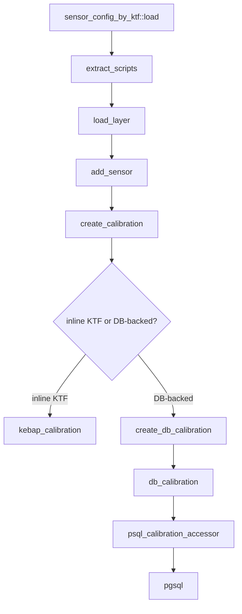

```mermaid 
flowchart TD
    A[sensor_config_by_ktf::load] --> B[extract_scripts]
    B --> C[load_layer]
    C --> D[add_sensor]
    D --> E[create_calibration]
    E --> F{inline KTF or DB-backed?}
    F -->|inline KTF| G[kebap_calibration]
    F -->|DB-backed| H[create_db_calibration]
    H --> I[db_calibration]
    I --> J[psql_calibration_accessor]
    J --> K[pgsql]

```

